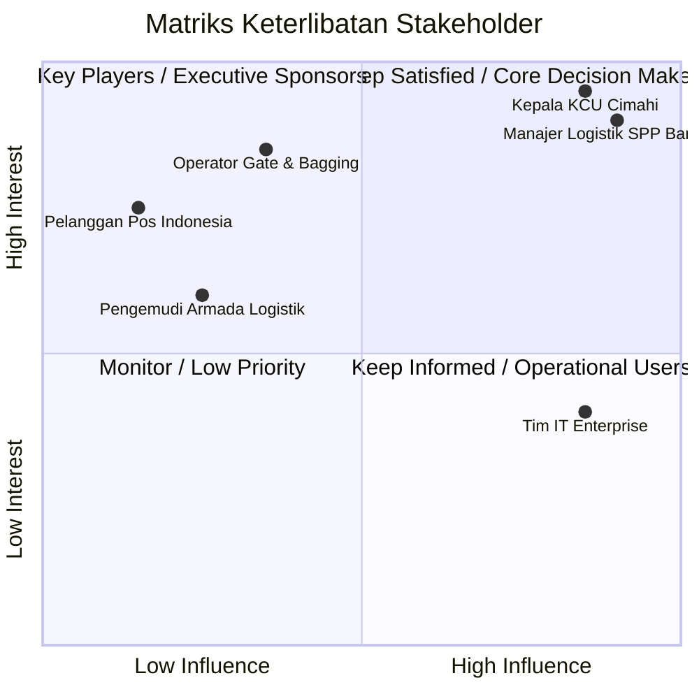

# 💼 Business Requirement Document (BRD)
## Cimahi Origin Delivery System (IPOS5 Redesign)

---

## 📑 Informasi Dokumen
* **Nama Proyek:** Cimahi Origin Delivery System (IPOS5 Redesign)
* **Unit Bisnis:** PT Pos Indonesia (Persero) - KCU Cimahi 40500 & SPP Bandung 40000
* **Versi Dokumen:** 3.0.0 (Full Web Architecture & Load Partitioning Update)
* **Status:** Approved
* **Tanggal:** 4 Agustus 2026
* **Sponsor Bisnis:** Kepala Kantor Cabang Utama Cimahi & Manajer Logistik SPP Bandung

---

## 1. Latar Belakang Bisnis & Pernyataan Masalah

### 1.1 Latar Belakang Bisnis
PT Pos Indonesia KCU Cimahi menangani ribuan paket kiriman setiap harinya yang berasal dari berbagai Kantor Pos Pembantu (KCP) di wilayah Cimahi dan Kabupaten Bandung Barat (seperti KCP Cililin, KCP Padalarang, dll). Seluruh kiriman ini harus dikonsolidasikan di KCU Cimahi, dibuatkan manifest kontainer, dan dikirimkan ke Sentral Pengolahan Pos (SPP) Bandung sebelum diteruskan ke lokasi tujuan akhir di seluruh Indonesia.

### 1.2 Masalah Bisnis Utama (*Business Pain Points*)
1. **Bottleneck Pemrosesan Bagging Manual:** Pencatatan resi ke dalam manifest secara konvensional sering memicu penumpukan barang (*bottleneck*) di *loading dock* KCU Cimahi pada jam-jam sibuk (*cut-off time*).
2. **Diskrepansi Data Kiriman:** Adanya selisih antara jumlah fisik paket yang dikirim dengan data manifest digital yang diterima oleh SPP Bandung akibat *human error* saat *entry*.
3. **Ketidakpastian Status Tracking (Data Anomaly):** Status kiriman sering meloncat (*status skipping*) atau terlambat diperbarui, sehingga menimbulkan komplain dari pelanggan terkait keakuratan informasi lacak kiriman.
4. **Kurangnya Visibilitas Real-time:** Manajemen kesulitan memantau jumlah armada yang sedang berjalan, kapasitas rute yang terpakai, dan estimasi waktu ketibaan paket secara presisi.

---

## 2. Sasaran & Tujuan Bisnis (*Business Objectives*)

| No | Sasaran Bisnis | Indikator Keberhasilan (Target Metric) |
| :--- | :--- | :--- |
| **BO-01** | Mempercepat Waktu Pemrosesan Outbound | Mengurangi waktu pemrosesan kiriman di gate outbound KCU Cimahi hingga **> 55%** (dari rata-rata 45 menit menjadi **< 20 menit** per manifest). |
| **BO-02** | Eliminasi Diskrepansi Data Manifest | Mencapai akurasi pencatatan resi dalam manifest hingga **99.9%** melalui enkapsulasi transaksi data ACID. |
| **BO-03** | Penataan Linear Status Kiriman | Menghilangkan **100%** kejadian *status skipping* atau transisi ilegal pada status kiriman pelanggan. |
| **BO-04** | Visibilitas Dashboard Operasional | Menyediakan informasi metrik logistik terorganisir yang dapat diakses oleh manajemen 24/7 dengan auto-refresh berkala. |

---

## 3. Matriks Stakeholder & Peran Bisnis

### Rincian Peran:
* **Kepala KCU Cimahi & Manajer SPP Bandung:** Pemilik proyek dan penentu kebijakan operasional alur pengiriman.
* **Operator Gate & Bagging:** Pengguna harian sistem yang mengoperasikan fitur *Checkpoint 1, 2, dan 3*.
* **Tim IT Enterprise / Super Admin:** Bertanggung jawab atas pengelolaan infrastruktur server Node.js, otorisasi RBAC, dan kluster database MongoDB.

---

## 4. Pemetaan Proses Bisnis (*Business Process Mapping*)

### 4.1 Proses Bisnis Eksisting (*As-Is Process*)
1. Paket diterima dari counter/KCP dan ditumpuk di area pemilahan KCU Cimahi.
2. Petugas memilah paket secara manual dan menginput satu per satu kode resi ke dalam lembar manifest spreadsheet/legacy.
3. Truk berangkat membawa barang fisik dan dokumen kertas manifest.
4. SPP Bandung menerima truk, membongkar muatan, dan melakukan kalkulasi manual matching antara kertas manifest dengan paket fisik.
5. Pembaruan status tracking terlambat di-update ke sistem pusat.

### 4.2 Proses Bisnis Baru (*To-Be Process*)
1. Paket yang masuk ke KCU Cimahi langsung tercatat dengan status linier `DITERIMA_DI_CIMAHI` dan dapat dipantau melalui modul **Data Transaksi Kiriman**.
2. Petugas menggunakan antarmuka **Transit & Gate Monitoring (Checkpoint 1)** untuk memilih paket individual dan meng-generate kode manifest digital terenkripsi (`MNFXXXXXX`). Status otomatis menjadi `IN_MANIFEST`.
3. Perjalanan penjemputan dan armada pengangkut dikelola melalui **Jadwal Pick Up SPP** dan dipantau via **Milk Run Progress Tracker (Manual Checkpoint Simulation)** & **Estimasi Milk Run Simulator**.
4. Saat armada tiba di SPP Bandung, petugas transit membuka modul **Checkpoint 2** dan melakukan scan massal kode manifest. Seluruh paket di dalam manifest berubah status menjadi `TRANSIT_SPP_BANDUNG` secara simultan dalam satu transaksi atomic (ACID).
5. Di SPP Tujuan akhir, modul **Checkpoint 3** memproses kedatangan (`TIBA_DI_SPP_TUJUAN`) dan penyelesaian pengiriman paket individual (`DELIVERED`).
6. Seluruh pergerakan terekam secara otomatis di **Dashboard Analytics**, **Routing Checker**, dan Audit Trail profil operator.

---

## 5. Aturan Bisnis & Batasan Sistem (*Business Rules*)

* **BR-01 (Kekakuan Transisi Status):** Paket tidak dapat meloncat status. Sebuah paket hanya bisa diubah menjadi `IN_MANIFEST` apabila status sebelumnya adalah `DITERIMA_DI_CIMAHI`.
* **BR-02 (Manifest Containment):** Satu kode manifest dapat menampung multiple nomor resi (`connote_code`), namun satu resi yang sedang aktif hanya boleh terikat pada **1 manifest** pada satu waktu.
* **BR-03 (Jaminan Audit Trail):** Setiap perubahan status kiriman wajib menyimpan identitas asal, identitas tujuan, timestamp presisi milidetik, serta ID manifest pendukung ke dalam array riwayat tracking (`tracking_history`).
* **BR-04 (Integritas Transaksi ACID):** Pembentukan manifest dan pemrosesan transit wajib gagal total (*full rollback*) apabila terdapat salah satu resi di dalam manifest yang mengalami kegagalan validasi status atau kegagalan koneksi database.
* **BR-05 (Otorisasi Akses Sensitif / RBAC):** Modul sensitif seperti Compass GUI dan Settings Connection String HANYA boleh diakses oleh pengguna bertipe `Super Admin / IT Enterprise`.

---

## 6. Metric Keberhasilan & Key Performance Indicators (KPIs)

| Kategori KPI | Indikator Utama | Baseline (Sistem Lama) | Target (Sistem Baru) |
| :--- | :--- | :--- | :--- |
| **Speed** | Avg Manifesting Processing Time | 45 Menit | **< 20 Menit** |
| **Accuracy** | Data Discrepancy Rate | 3.5% | **< 0.05%** |
| **Reliability** | Successful ACID Transactions | N/A (Non-transactional) | **99.99%** |
| **Visibility** | Dashboard Auto-Refresh Polling | 1 - 2 Jam | **Auto-refresh 5 - 10 Detik** |

---

## 7. Analisis Risiko & Strategi Mitigasi

| Risiko Bisnis | Tingkat Dampak | Strategi Mitigasi |
| :--- | :--- | :--- |
| **Kegagalan Koneksi Network di Gate Monitoring** | Tinggi | Backend menyediakan transaction rollback otomatis, serta frontend menyediakan pesan visual error alert yang jelas kepada operator. |
| **Kerusakan Node Primary Database MongoDB** | Sangat Tinggi | Penggunaan topologi **MongoDB Replica Set** yang mendukung otomatis *failover* ke node Secondary tanpa memutus transaksi aktif. |
| **Akses Ilegal ke Database/Settings** | Sangat Tinggi | Penerapan Role-Based Access Control (RBAC) ketat dan enkripsi token session untuk modul Compass dan Settings. |
| **Resistensi Pengguna (Operator Gudang)** | Sedang | Pembuatan antarmuka UI modern berbasis **Navy Premium Theme** yang sangat ramah pengguna (*user-friendly*), responsif, dan mudah dipahami dengan bantuan visual ikon Lucide. |

---

## 8. Dampak Bisnis Load Partitioning & Control Tower

### 8.1 Solusi Kelebihan Muatan Fisik (Load Partitioning)
* **Nilai Tambah Bisnis:** Mencegah pelanggaran *Over Dimension Over Load (ODOL)* dan kerusakan fisik pada truk box berkapasitas 1,5 Ton ketika menangani akumulasi data resi hingga 14,4 Ton.
* **Mekanisme Otomasi:** Sistem membagi muatan menjadi **Trip 1 (1.500 kg / 100% Utilisasi - SAFE)** dan mengalokasikan sisa muatan **12,9 Ton** ke daftar antrean Trip 2 / Armada Cadangan.

### 8.2 Saran & Kesimpulan Bisnis
* **Rekomendasi Roadmap Masa Depan:** 
  1. Mengotomasikan pembuatan jadwal berulang (*Auto-Dispatcher Multi-Trip*) saat antrean melimpah terdeteksi.
  2. Mengintegrasikan alat GPS Telematika IoT untuk otomatisasi pelacakan posisi dan kecepatan truk real-time (saat ini masih berbasis simulator/manual checkpoint progress).
  3. Mengaktifkan notifikasi peringatan dini (*Overspill Alert*) ke supervisor logistik saat antrean > 5 Ton.
* **Kesimpulan Bisnis:** 
  Aplikasi Web Redesign IPOS5 menjamin operasional logistik PT Pos Indonesia berjalan **aman secara fisik, terukur secara matematis, transparan bagi pelanggan, dan patuh pada standar keselamatan transportasi**.

---
*© PT Pos Indonesia - BRD Cimahi Origin Delivery System*
