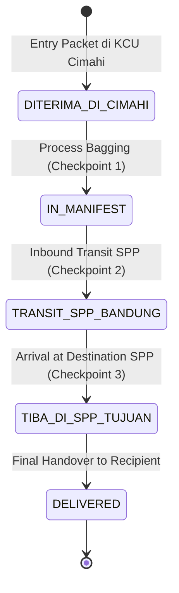

# 📄 Product Requirement Document (PRD)
## Cimahi Origin Delivery System (IPOS5 Redesign)

---

## 📑 Informasi Dokumen
* **Nama Produk:** Cimahi Origin Delivery System (IPOS5 Redesign)
* **Versi Dokumen:** 3.0.0 (Full Web Architecture & Load Partitioning Update)
* **Status:** Approved / Active
* **Tanggal:** 4 Agustus 2026
* **Target Audience:** Tim Pengembang (Frontend & Backend), Tim Database Administrator, QA Engineer, dan Operational Manager KCU Cimahi / SPP Bandung.

---

## 1. Visi Produk & Ringkasan Eksekutif

### 1.1 Visi Produk
Membangun platform manajemen logistik asal (*origin delivery system*) yang modern, responsif, dan ultra-andal untuk PT Pos Indonesia (KCU Cimahi & SPP Bandung). Sistem ini berfungsi sebagai **Control Tower** operasional logistik yang mengotomatiskan alur pemrosesan kiriman dari pencatatan awal di kantor asal, pembatasan muatan fisik kendaraan (*load partitioning*), pembuatan manifest kontainer, transit di SPP Bandung, hingga serah terima di SPP tujuan akhir.

### 1.2 Tujuan Utama
1. **Load Partitioning & Anti-Overload Armada:** Membatasi muatan fisik armada box (seperti B 9910 PCX) pada batas aman **1.500 kg (100% Utilisasi - SAFE)** dan memisahkan antrean melimpah **12,9 Ton** ke antrean Trip 2 / armada tambahan.
2. **Otomasi Konsolidasi Manifest (Checkpoint Gate Monitoring):** Mengeliminasi pencatatan manual bagging dan mengurangi kesalahan penyusunan manifest via Checkpoint 1, 2, dan 3.
3. **State Machine Linier:** Mengunci transisi status kiriman agar urut (`DITERIMA_DI_CIMAHI` → `IN_MANIFEST` → `TRANSIT_SPP_BANDUNG` → `TIBA_DI_SPP_TUJUAN` → `DELIVERED`).
4. **Visibilitas Telemetri & Simulator ETA Real-Time:** Menyediakan simulator rute Milk Run dengan penyesuaian kecepatan rata-rata (20/40/80 km/j) dan perkiraan waktu tiba presisi di SPP Bandung.
5. **Jaminan Integritas Data (ACID):** Menggunakan MongoDB Session Transactions untuk transaksi pembentukan dan pemrosesan manifest tanpa risiko *partial writes*.

---

## 2. Persona Pengguna (*User Personas*)

| Persona | Peran | Tugas & Kebutuhan Utama |
| :--- | :--- | :--- |
| **Operator Counter KCU Cimahi** | Inputter Kiriman | Menerima paket dari pengirim, mencatat nomor resi (`connote_code`), dan menetapkan status awal `DITERIMA_DI_CIMAHI`. |
| **Dispatcher / Manifesting Officer** | Pengelola Bagging & Outbound | Memilih paket-paket individual berstatus `DITERIMA_DI_CIMAHI` untuk digabungkan dalam Manifest Kontainer baru (`IN_MANIFEST`). |
| **Operator Transit SPP Bandung** | Tim Hub Logistik Transit | Melakukan proses scan in / transit massal manifest kontainer yang masuk dari Cimahi (`TRANSIT_SPP_BANDUNG`). |
| **Operator Last-Mile SPP Tujuan** | Receiver & Courier Hub | Memproses kedatangan manifest (`TIBA_DI_SPP_TUJUAN`) dan memperbarui status paket individual menjadi `DELIVERED`. |
| **Super Admin & Supervisor Logistik** | Monitoring & Master Data | Memantau KPI statistik di Dashboard, mengelola master kantor/rute/jadwal, serta melakukan inspeksi database melalui Compass GUI internal. |

---

## 3. Spesifikasi Kebutuhan Fungsional (*Functional Requirements*)

### 3.1 Modul 1: Dashboard Monitoring (`FR-DB-001` hingga `FR-DB-004`)
* **FR-DB-001:** System harus menampilkan ringkasan metrik statistik real-time: Total Kantor Pos Terdaftar, Jumlah Produk Aktif, Jumlah Kendaraan Logistik, dan Jumlah Rute Utama.
* **FR-DB-002:** System harus menyajikan breakdown jumlah paket berdasarkan status linier tanpa melakukan *hardcoding* atau transformasi nama key.
* **FR-DB-003:** Grafik breakdown status harus mendukung interaksi *hover* dan *click to filter*, yang akan memfilter daftar rincian status paket secara dinamis.
* **FR-DB-004:** Antarmuka dasbor wajib menggunakan layout responsif dengan penanganan *empty space* yang optimal.

### 3.2 Modul 2: Data Transaksi Kiriman (`FR-TX-001` hingga `FR-TX-003`)
* **FR-TX-001:** System harus menyediakan pencarian cepat resi (`connote_code`) dan penataan data berhalaman (pagination 25/50/100 baris per halaman).
* **FR-TX-002:** System harus menyediakan multi-filtering interaktif berdasarkan status linier, jenis layanan, Nopend tujuan, kode regional, dan armada pengirim.
* **FR-TX-003:** System harus menyediakan fitur ekspor data transaksi serta modal detail informasi armada dan tracking history.

### 3.3 Modul 3: Routing Checker & Audit Trail (`FR-CH-001` hingga `FR-CH-003`)
* **FR-CH-001:** System harus menyediakan kolom pencarian nomor resi (`connote_code`) dengan penanganan *error state* jika resi tidak ditemukan.
* **FR-CH-002:** System harus menampilkan visualisasi alur rute dari Kantor Pos Asal (contoh: KCP Cililin) menuju SPP Bandung hingga Kantor Tujuan Akhir.
* **FR-CH-003:** System harus menyajikan **Tabel Audit Trail (Riwayat Perjalanan)** yang merekam jejak perjalanan kronologis paket berdasarkan array `tracking_history`.

### 3.4 Modul 4: Manajemen Master Data (`FR-MD-001` hingga `FR-MD-006`)
* **FR-MD-001 (Master Kantor):** Mampu melakukan CRUD data kantor pos (`nopend`, `nama_nopend`, `kdregional`, `status`). Mendukung pencarian data legacy (>13.000 kantor pos) dengan pagination dan filter status `AKTIF`/`NONAKTIF`.
* **FR-MD-002 (Master Layanan/Produk):** Mampu mengelola produk Pos Indonesia (Pos Sameday, Nextday, Kilat Khusus, dll).
* **FR-MD-003 (Master Kendaraan):** Mampu mencatat data nopol, jenis kendaraan, dan kapasitas armada logistik.
* **FR-MD-004 (Master Rute):** Mampu memetakan rute pengiriman asal-tujuan. Menyediakan komponen *autocomplete* Nopend kantor pos secara otomatis.
* **FR-MD-005 (Jadwal Pick Up SPP):** Mampu menyajikan rute pickup SPP Bandung, menghitung estimasi ETA kedatangan di tiap perhentian, serta opsi penyaringan stop yang di-skip.
* **FR-MD-006 (Template & Penjadwalan):** Mampu mengatur template rutin mingguan dan men-generate jadwal perjalanan armada bulanan secara otomatis.

### 3.5 Modul 5: Progress Tracker & Simulator Milk Run (`FR-MR-001` hingga `FR-MR-003`)
* **FR-MR-001 (Milk Run Progress Tracker - Manual Checkpoint Simulation):** System harus menampilkan visualisasi pergerakan waypoint rute, status perhentian (Waiting/Skipped/Completed), dan meteran kapasitas daya angkut (*load capacity*). *Catatan Penting:* Progres pergerakan armada pada versi ini di-update secara manual oleh operator via checkpoint/simulasi (tombol "Lanjut ke Stop Berikutnya"). Integrasi feed GPS/IoT otomatis BELUM diimplementasikan pada versi ini dan disiapkan untuk roadmap masa depan.
* **FR-MR-002 (Milk Run Simulator):** System harus menyediakan simulator rute Milk Run interaktif dengan kalkulasi ETA presisi (slider kecepatan 20/40/80 km/j), waktu muat, dan filter status rute.
* **FR-MR-003 (Skipped Stop Handling):** System harus mampu mengabaikan titik perhentian yang tidak memiliki muatan (*skipped stop*) secara otomatis tanpa memutus alur rute.

### 3.6 Modul 6: Transit & Gate Monitoring System (`FR-GM-001` hingga `FR-GM-004`)
* **FR-GM-001 (Checkpoint 1 - Bagging & Manifesting):** Filter paket individual berstatus `DITERIMA_DI_CIMAHI`. Operator dapat memilih paket-paket tersebut dan membentuk kode manifest kontainer baru (`MNFXXXXXX`). Status paket otomatis berubah menjadi `IN_MANIFEST`.
* **FR-GM-002 (Checkpoint 2 - Inbound Transit SPP Bandung):** Operator memasukkan/scan kode manifest. System memproses seluruh resi di dalam manifest tersebut menjadi status `TRANSIT_SPP_BANDUNG`.
* **FR-GM-003 (Checkpoint 3 - Arrival & Last-Mile Delivery):** Operator memproses kedatangan manifest di SPP tujuan (`TIBA_DI_SPP_TUJUAN`) dan dapat menyelesaikan status pengiriman paket individual menjadi `DELIVERED`.
* **FR-GM-004 (ACID Transaction Rule):** Seluruh operasi perubahan status manifest dan pembentukan manifest wajib dibungkus dalam MongoDB Session Transaction untuk menjamin atomisitas data.

### 3.7 Modul 7: Otentikasi & Control Akses Berbasis Peran / RBAC (`FR-AUTH-001` hingga `FR-AUTH-003`)
* **FR-AUTH-001 (User Authentication & Session):** System harus menyediakan mekanisme login aman (username/password), manajemen sesi pengguna, dan pencatatan log akses.
* **FR-AUTH-002 (Role-Based Access Control / RBAC):** System harus membatasi hak akses fitur berdasarkan peran pengguna (Minimal 4 Peran: *Operator Counter*, *Dispatcher*, *Operational Supervisor*, dan *Super Admin / IT Enterprise*).
* **FR-AUTH-003 (Restricted Sensitive Modules):** Modul **Compass (`FR-SYS-001`)** dan **Settings (`FR-SYS-002`)** HANYA boleh diakses oleh akun berkategori *Super Admin / IT Enterprise*. Setiap percobaan akses dan perubahan konfigurasi wajib tercatat di audit log keamanan.

### 3.8 Modul 8: System Settings, Compass & Profile (`FR-SYS-001` hingga `FR-SYS-003`)
* **FR-SYS-001 (Internal Compass - Restricted):** Menyediakan antarmuka GUI internal untuk melihat koleksi MongoDB, struktur dokumen, dan indeks tanpa aplikasi pihak ketiga (Khusus Super Admin).
* **FR-SYS-002 (Settings Connection - Restricted):** Memungkinkan pengubahan profil koneksi URI MongoDB secara dinamis tanpa perlu me-restart server Express (Khusus Super Admin).
* **FR-SYS-003 (Profile Management):** Menyediakan manajemen akun pengguna (contoh: `Sari Rahayu` - Operational Supervisor), riwayat log aktivitas pengguna, dan konfigurasi preferensi notifikasi sistem.

---

## 4. Kebutuhan Non-Fungsional (*Non-Functional Requirements*)

### 4.1 Performa & Responsivitas (`NFR-PERF`)
* **Waktu Respon API:** API response time < 200ms untuk query standar dan < 500ms untuk transaksi multi-document manifest.
* **Waktu Muat SPA:** Initial Page Load Frontend < 1.5 detik menggunakan Vite bundle optimization.

### 4.2 Integritas Data & Keamanan (`NFR-SEC`)
* **Atomisitas Transaksi (ACID):** Transaksi bagging dan transit tidak boleh meninggalkan state *half-updated*. Jika 1 resi gagal di-update, seluruh transaksi di-rollback.
* **Keamanan Akses & RBAC (`NFR-SEC-002`):** Seluruh endpoint API sensitif wajib memvalidasi token sesi/JWT pengguna. Sesi otomatis kadaluarsa (session timeout) setelah 60 menit inaktivitas. Password disimpan menggunakan hashing bcrypt dengan salt round minimum 10.
* **Validasi Input Backend:** Validasi ketat format Nopend, Connote Code, dan Master Manifest Code di layer controller Express.

### 4.3 Desain Antarmuka & UX (`NFR-UX`)
* **Navy Premium Design Token:** Menggunakan konsistensi warna Dark Navy (`#0b132b`, `#1c2541`), glowing cyan accent (`#48cae4`), dan komponen visual glassmorphism.
* **Micro-Animations:** Transisi smooth pada hover kartu, tab switching, dan pembaruan grafik breakdown.

---

## 5. State Machine Linier Transisi Status Paket

Aplikasi memberlakukan aturan transisi status paket yang kaku di Backend (`TransactionController.js`):

---

## 6. Kriteria Penerimaan (*Acceptance Criteria*)

1. **AC-01 (Manifest Creation):** Ketika operator membuat manifest dengan 5 resi berstatus `DITERIMA_DI_CIMAHI`, maka dibuat 1 dokumen manifest di koleksi `manifests`, dan 5 dokumen di koleksi `transaksi` secara teratomik berubah statusnya menjadi `IN_MANIFEST` serta mencatat riwayat di `tracking_history`.
2. **AC-02 (Invalid Transition Prevention):** Jika resi masih berstatus `DITERIMA_DI_CIMAHI` dan dilakukan permohonan transit langsung ke `TRANSIT_SPP_BANDUNG` tanpa melalui `IN_MANIFEST`, backend wajib menolak request dengan status HTTP 400 Bad Request.
3. **AC-03 (Audit Trail Accuracy):** Setiap perubahan status harus menambahkan entri baru pada array `tracking_history` berisi timestamp `changedAt`, status asal, status tujuan, dan `manifest_id` (jika ada).
4. **AC-04 (RBAC Enforcement):** Jika pengguna dengan role selain Super Admin mencoba mengakses endpoint `/api/compass` atau `/api/settings`, backend wajib menolak dengan HTTP 403 Forbidden dan mencatat insiden di audit log.

---
*© PT Pos Indonesia - PRD Cimahi Origin Delivery System*
