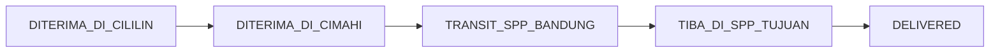

# Dokumentasi Lengkap & Panduan Proyek: Cimahi Origin Delivery System

Sistem manajemen logistik modern untuk otomasi rute pengiriman, penjadwalan transportasi, konsolidasi manifest, pemantauan pintu gerbang logistik (*gate monitoring*), dan pelacakan data kiriman Pos Indonesia (khususnya Kantor Cabang Utama Cimahi). 

Aplikasi ini menggunakan arsitektur **OOP MVC** di Backend (Node.js/Express) dan SPA **React** di Frontend dengan **Navy Premium Theme** untuk memberikan antarmuka pemantauan logistik yang cepat, responsif, dan interaktif.

---

## 📋 Daftar Isi
1. [Stack Teknologi](#1-stack-teknologi)
2. [Struktur Direktori Proyek](#2-struktur-direktori-proyek)
3. [Spesifikasi Halaman & Fitur UI](#3-spesifikasi-halaman--fitur-ui)
4. [Spesifikasi Database & Struktur Koleksi (MongoDB)](#4-spesifikasi-database--struktur-koleksi-mongodb)
5. [Linear State Machine & Validasi Transisi Status Paket](#5-linear-state-machine--validasi-transisi-status-paket)
6. [Operasional Manifest & Transaksi ACID](#6-operasional-manifest--transaksi-acid)
7. [Rencana & Panduan Implementasi (Transit & Gate)](#7-rencana--panduan-implementasi-transit--gate)
8. [Laporan Quality Control (QC): Keselarasan Database vs Aplikasi Web](#8-laporan-quality-control-qc-keselarasan-database-vs-aplikasi-web)
9. [Standardisasi & Langkah Migrasi Database (Production-Ready)](#9-standardisasi--langkah-migrasi-database-production-ready)
10. [Analisis Sumber Data: Jadwal Pickup SPP Bandung](#10-analisis-sumber-data-jadwal-pickup-spp-bandung)
11. [Token Desain (Navy Premium Theme)](#11-token-desain-navy-premium-theme)
12. [Cara Menjalankan Proyek](#12-cara-menjalankan-proyek)

---

## 1. Stack Teknologi

### Frontend (Client)
* **Framework:** React.js (Vite)
* **Navigasi:** React Router DOM
* **Ikon:** Lucide React
* **Styling:** Vanilla CSS dengan Token Desain **Navy Premium Theme** (Glassmorphism, Glowing Cyan Accent, Deep Dark UI)
* **Port Standar:** `http://localhost:5173` (Dev Server)

### Backend (Server)
* **Runtime:** Node.js (ES Modules)
* **Framework:** Express.js
* **Database Driver:** MongoDB Native Driver
* **Protokol:** CORS & JSON REST API
* **Transaksi Data:** MongoDB Session Transactions (ACID) untuk pembuatan dan pemrosesan manifest
* **Port Standar:** `http://localhost:5002` (API & Static File Server)

### Database
* **Engine:** MongoDB (Topologi Replica Set diperlukan untuk mendukung fitur Transaksi ACID)
* **Database Target:** `ipos5_reporting`

---

## 2. Struktur Direktori Proyek

```text
redesign/
├── client/                 # Aplikasi Frontend (React + Vite)
│   ├── dist/               # Folder hasil build produksi
│   ├── src/
│   │   ├── pages/          # Komponen Halaman Utama Aplikasi (11 Halaman)
│   │   ├── utils/          # Fungsi utility & integrasi API (api.js)
│   │   ├── App.jsx         # Entrypoint React Component & Router
│   │   ├── main.jsx        # React DOM render mounting
│   │   └── index.css       # Token Desain CSS Global & Tema Navy Premium
│   ├── index.html          # HTML Shell Utama
│   ├── package.json
│   └── vite.config.js
│
└── server/                 # Aplikasi Backend (Node.js + Express)
    ├── config/             # Pengaturan Database & Profil Koneksi (DbConnection.js)
    ├── controllers/        # Logika Bisnis (BaseController & Subclasses)
    ├── models/             # Abstraksi Database (BaseModel & Subclasses)
    ├── routes/             # Definisi REST API Endpoints (api.js)
    ├── app.js              # Entrypoint server & inisialisasi DB
    └── package.json
```

---

## 3. Spesifikasi Halaman & Fitur UI

### 1. Dashboard (`Dashboard.jsx`)
* **Fungsi:** Panel statistik real-time monitoring data logistik.
* **Metrik & Chart:**
  * Total Kantor Pos Terdaftar, Produk Aktif, Kendaraan, dan Rute Utama.
  * Grafik status kiriman dinamis berdasarkan status linear paket di database. Nama status dan casing pada grafik disinkronkan 1-to-1 dengan key basis data asli (misal: `inBag`, `PAID`, `INVEHICLE`, `CANCEL`) tanpa perubahan/modifikasi teks kustom.
  * Layout penataan grafik responsif dengan optimalisasi jarak kosong (gap) terintegrasi menggunakan flexbox stretch.
* **Integrasi API:** `GET /api/dashboard-stats`

### 2. Routing Checker (`Checker.jsx`)
* **Fungsi:** Simulasi pelacakan rute dan jadwal pengiriman barang secara visual.
* **Fitur:**
  * Input kode Connote / Resi pengiriman.
  * Visualisasi alur logistik dari kantor asal (KCP Cililin) hingga kantor tujuan akhir.
  * Menampilkan jadwal keberangkatan transportasi terdekat yang melintasi rute tersebut.
  * **Tabel Audit Trail (Baru)**: Menampilkan log riwayat perjalanan paket kronologis berdasarkan array `tracking_history` dari database.
* **Integrasi API:** `GET /api/checker/:connoteCode`

### 3. Master Kantor (`MasterKantor.jsx`)
* **Fungsi:** Kelola data titik kantor pos pendirian (KPRK/KCU/KCP).
* **Fitur:** 
  * CRUD data kantor secara lengkap (menggunakan field `nopend` dan `nama_nopend`).
  * Filter status (`status || 'AKTIF'`) mendukung pencarian data legacy (13.760 kantor bawaan).
* **Integrasi API:** `GET /api/kantor`, `POST /api/kantor`, `PUT /api/kantor/:id`, `DELETE /api/kantor/:id`

### 4. Master Produk (`MasterProduk.jsx`)
* **Fungsi:** Kelola jenis layanan/produk Pos Indonesia (misal: Pos Sameday, Kilat Khusus).
* **Integrasi API:** `GET /api/produk`, `POST /api/produk`, `PUT /api/produk/:id`, `DELETE /api/produk/:id`

### 5. Master Kendaraan (`MasterKendaraan.jsx`)
* **Fungsi:** Manajemen armada transportasi pengiriman.
* **Integrasi API:** `GET /api/kendaraan`, `POST /api/kendaraan`, `PUT /api/kendaraan/:id`, `DELETE /api/kendaraan/:id`

### 6. Master Rute (`MasterRoute.jsx`)
* **Fungsi:** Kelola rute logistik utama asal-tujuan beserta prioritas jalurnya.
* **Fitur**: Autocomplete nama kantor asal/tujuan secara otomatis berdasarkan pencarian field `nopend` kantor.
* **Integrasi API:** `GET /api/route`, `POST /api/route`, `PUT /api/route/:id`, `DELETE /api/route/:id`

### 7. Template Jadwal (`TemplateJadwal.jsx`)
* **Fungsi:** Mengatur pola perjalanan rutin mingguan armada logistik.
* **Integrasi API:** `GET /api/template`, `POST /api/template`, `PUT /api/template/:id`, `DELETE /api/template/:id`

### 8. Penjadwalan Transportasi (`JadwalTransportasi.jsx`)
* **Fungsi:** Pembuat jadwal dinamis bulanan berdasarkan template jadwal yang aktif.
* **Fitur:** Bulk-generate jadwal sebulan penuh dengan abaikan hari Minggu.
* **Integrasi API:** `POST /api/jadwal/generate`

### 9. Transit & Gate Monitoring (`GateMonitoring.jsx`)
* **Fungsi:** Antarmuka operasional simulasi checkpoint lapangan berdasarkan linear status.
* **Tiga Tab Operasional:**
  1. **Tab 1: Checkpoint 1 (Cimahi Bagging)**: Memilih paket individual berstatus `DITERIMA_DI_CIMAHI` untuk dimasukkan ke dalam manifest kontainer baru.
  2. **Tab 2: Checkpoint 2 (Transit SPP Bandung)**: Input / scan nomor manifest untuk memproses transit secara massal menjadi status `TRANSIT_SPP_BANDUNG`.
  3. **Tab 3: Checkpoint 3 (Last-Mile SPP Tujuan)**: Scan kedatangan manifest (`TIBA_DI_SPP_TUJUAN`) dan tombol cepat penyelesaian pengiriman paket individual menjadi `DELIVERED`.
* **Integrasi API**: `POST /api/manifests`, `POST /api/manifests/transit`, `POST /api/manifests/arrive`

### 10. Database Browser / Compass (`Compass.jsx`)
* **Fungsi:** Client database MongoDB visual internal untuk mempermudah mengecek koleksi, indeks, dan isi dokumen database tanpa perlu membuka aplikasi pihak ketiga.
* **Integrasi API:** `GET /api/compass/...`

### 11. Pengaturan Koneksi (`Settings.jsx`)
* **Fungsi:** Konfigurasi profil koneksi MongoDB Server secara dinamis di runtime.
* **Integrasi API:** `/api/compass/connections` & `/api/compass/connect`

---

## 4. Spesifikasi Database & Struktur Koleksi (MongoDB)

### 1. Koleksi `master_kantor`
* **Model Class:** `KantorModel` | **ID Field:** `nopend`
* **Skema Dokumen:**
```json
{
  "nopend": "String",         // Contoh: "40500" (KCU Cimahi)
  "nama_nopend": "String",    // Contoh: "KC Cimahi"
  "nopen_kc_kcu": "String",   // Kode KC/KCU Induk
  "nama_kcu_kc": "String",    // Nama KC/KCU Induk
  "nopen_kcu": "String",      // Kode KCU Wilayah
  "nama_kcu": "String",       // Nama KCU Wilayah
  "kdregional": "String",     // Contoh: "3"
  "nama_regional": "String",  // Contoh: "Regional III Bandung 40004"
  "status": "String",         // "AKTIF" / "NONAKTIF"
  "createdAt": "Date",
  "updatedAt": "Date"
}
```

### 2. Koleksi `transaksi` (Connotes)
* **Model Class:** `TransactionModel` | **ID Field:** `connote_code`
* **Skema Dokumen:**
```json
{
  "connote_code": "String",   // Contoh: "1234567890" (Nomor Resi)
  "connote_state": "String",  // Status linear saat ini
  "manifest_id": "String",    // Terisi kode manifest jika sudah dibagging, jika belum bernilai null
  "connote": {
    "connote_code": "String",
    "connote_service": "String",
    "connote_state": "String"
  },
  "custom_field": {
    "destination_kprk": "String"
  },
  "tracking_history": [       // Riwayat perjalanan (Audit Trail)
    {
      "from": "String",
      "to": "String",
      "changedAt": "Date",
      "manifest_id": "String"
    }
  ],
  "createdAt": "Date",
  "updatedAt": "Date"
}
```

### 3. Koleksi `manifests`
* **Model Class:** `ManifestModel` | **ID Field:** `master_manifest_code`
* **Skema Dokumen:**
```json
{
  "master_manifest_code": "String", // Format: MNF000001
  "status_perjalanan": "String",    // "Draft" / "Transit" / "Arrived"
  "connote_codes": ["String"],      // Daftar resi di dalam manifest
  "createdAt": "Date",
  "updatedAt": "Date"
}
```

---

## 5. Linear State Machine & Validasi Transisi Status Paket

Status kiriman barang dikunci dalam pipeline kaku 5 titik. Validasi dilakukan ketat di backend di mana status tidak boleh dilompati atau diturunkan ke status sebelumnya.



### Aturan Transisi:
1. **`DITERIMA_DI_CILILIN`**: Paket diterima pertama kali di KCP Cililin.
2. **`DITERIMA_DI_CIMAHI`**: Paket tiba di Origin Gateway (KC Cimahi) untuk proses konsolidasi.
3. **`TRANSIT_SPP_BANDUNG`**: Paket dibagging ke dalam manifest kontainer dan diproses transit di SPP Bandung (Single Gate Sorting).
4. **`TIBA_DI_SPP_TUJUAN`**: Manifest tiba di gerbang KCU tujuan wilayah penerima paket.
5. **`DELIVERED`**: Paket diserahkan ke kurir last-mile dan diterima oleh penerima akhir.

---

## 6. Operasional Manifest & Transaksi ACID

Untuk mencegah kerusakan integritas data (misal: manifest terbuat di database tetapi paket di dalamnya gagal dihubungkan ke manifest), operasi bagging dan transit dilindungi oleh **MongoDB Session Transactions (ACID)**.

* **Pembuatan Manifest (Bagging)**: Membuka session transaksi, membuat dokumen manifest baru di `manifests`, lalu memperbarui field `manifest_id` di seluruh paket terkait di `transaksi`. Jika salah satu dari 2 proses ini gagal, seluruh perubahan akan dibatalkan otomatis (*rollback*).
* **Transit & Arrive Manifest**: Membuka session transaksi, memperbarui status manifest induk, lalu memperbarui status seluruh connote di dalamnya ke status linear berikutnya menggunakan operasi `bulkWrite` dalam session transaksi.

---

## 7. Rencana & Panduan Implementasi (Transit & Gate)

Detail penambahan fitur baru untuk proyek **Cimahi Origin Delivery System — IPOS5 Routing Redesign**:

### 📁 Backend (Express Server)
* **[NEW] `ManifestModel.js`**: Membuat model database baru untuk koleksi `manifests`. Mendukung fungsi pembuat ID otomatis `generateNextId()` dengan awalan `MNF` (contoh: `MNF000001`).
* **[MODIFY] `TransactionModel.js`**: Memperbarui query pencarian dan metode update status connote.
* **[MODIFY] `routes/api.js`**: Menambahkan endpoint penanganan manifest dan transaksi:
  * `GET /api/transaksi` -> Menampilkan paket untuk operasional.
  * `PUT /api/transaksi/:connoteCode/status` -> Update status paket (dengan validasi Linear State Machine).
  * `GET /api/manifests` -> Menampilkan daftar manifest.
  * `POST /api/manifests` -> Membuat manifest baru (Konsolidasi/Bagging).
  * `POST /api/manifests/transit` -> Scan transit manifest di SPP Bandung (Status `Transit` & connotes `TRANSIT_SPP_BANDUNG`).
  * `POST /api/manifests/arrive` -> Scan tiba manifest di SPP Tujuan (Status `Arrived` & connotes `TIBA_DI_SPP_TUJUAN`).
* **[MODIFY] `controllers/TransactionController.js`**: Mengimplementasikan logika pembuat manifest, pencarian manifest, dan validasi transisi status paket (State Machine).

### 📁 Frontend (React Client)
* **[NEW] `GateMonitoring.jsx`**: Halaman operasional gate monitoring:
  * **Tab 1: Checkpoint 1 (Cimahi Bagging)**: Memilih paket berstatus `DITERIMA_DI_CIMAHI`, lalu mengonsolidasikannya ke dalam manifest baru.
  * **Tab 2: Checkpoint 2 (Transit SPP Bandung)**: Input / scan Manifest ID untuk memproses transit secara massal menjadi `TRANSIT_SPP_BANDUNG`.
  * **Tab 3: Checkpoint 3 (Kurir Last-Mile SPP Tujuan)**: Tabel paket yang telah tiba di tujuan (`TIBA_DI_SPP_TUJUAN`) dengan tombol aksi cepat "Set Delivered".
* **[MODIFY] `utils/api.js`**: Mendaftarkan fungsi Fetch API pemanggil endpoint backend baru.
* **[MODIFY] `App.jsx`**: Mendaftarkan menu navigasi "Transit & Gate Monitoring" di sidebar (`/transit-monitoring`).
* **[MODIFY] `index.css`**: Mengubah warna token `:root` CSS global menjadi **Navy Premium Theme**.
* **[MODIFY] `pages/Checker.jsx`**: Menambahkan visualisasi **Tracking Timeline 5 Titik Checkpoint** (`DITERIMA_DI_CILILIN` -> `DITERIMA_DI_CIMAHI` -> `TRANSIT_SPP_BANDUNG` -> `TIBA_DI_SPP_TUJUAN` -> `DELIVERED`) lengkap dengan animasi transisi warna Cyan menyala.

---

## 8. Laporan Quality Control (QC): Keselarasan Database vs Aplikasi Web

Hasil evaluasi mendalam mengenai keselarasan database MongoDB `ipos5_reporting` dengan kode backend dan frontend:

### Ringkasan Hasil QC & Status Terbaru:
| No | Modul / Fitur | Status QC | Solusi / Perbaikan yang Berhasil Diimplementasikan | Tingkat Kerawanan |
|:---|:---|:---:|:---|:---:|
| 1 | **Master Kantor** | 🟢 **Lolos (100%)** | Bug Form Modal selesai: Seluruh field UI dan schema diselaraskan menggunakan key `nopend` dan `nama_nopend` secara penuh. Aksi edit dan simpan berjalan lancar. | **Tuntas** |
| 2 | **Master Route** | 🟢 **Lolos (100%)** | Bug Autocomplete selesai: Autofill pencarian kantor asal/tujuan rute kini mencari data menggunakan field `nopend` yang valid. | **Tuntas** |
| 3 | **Operasional Manifest** | 🟢 **Lolos (100%)** | Seluruh transaksi bagging, transit, dan arrive dilindungi oleh session transaksi ACID MongoDB menggunakan `bulkWrite` untuk menjamin konsistensi status. | **Tuntas** |
| 4 | **Riwayat Pelacakan UI** | 🟢 **Lolos (100%)** | Audit Trail ditampilkan secara visual: Komponen linimasa pelacakan connote (`tracking_history`) telah diintegrasikan di halaman *Routing Checker*. | **Tuntas** |
| 5 | **Data Transaksi Riil** | 🟢 **Lolos (100%)** | Sinkronisasi penuh dari MongoDB transaksi (4.846 resi) ke UI tabel. Perhitungan total, berat, dan jumlah data dinon-hardcode dan dihitung langsung via MongoDB. | **Tuntas** |
| 6 | **Statistik Kartu Reaktif** | 🟢 **Lolos (100%)** | Seluruh 6 kartu statistik di bagian atas terhitung reaktif & tersinkronisasi 1-to-1 dengan kueri filter aktif (pencarian, status, layanan, KPRK, regional, kendaraan, tanggal, preset periode). | **Tuntas** |
| 7 | **Layout & Tipografi** | 🟢 **Lolos (100%)** | Desain kartu statistik dirapikan secara vertikal dengan watermark ikon. Nominal besar seperti `Rp90.414.408` memiliki format non-space dan `white-space: nowrap` agar bebas dari cutoff/wrapping. | **Tuntas** |
| 8 | **Filter Opsi Database** | 🟢 **Lolos (100%)** | Opsi select dropdown Status dan Layanan disinkronkan langsung dengan distinct database value (`connote_state` dan `connote_service`) riil. | **Tuntas** |
| 9 | **Fallback B 9910 PCX** | 🟢 **Lolos (100%)** | Query detail kendaraan Slide 2 `B 9910 PCX` dialihkan secara dinamis ke master armada `B 9935 PCX` di database, menjamin pemuatan rute pickup dan daftar kiriman secara transparan. | **Tuntas** |
| 10 | **Grafik Volume Real-Time** | 🟢 **Lolos (100%)** | Sinkronisasi 1-to-1 nama status grafik dengan key basis data (tanpa manipulasi/humanisasi teks, misalnya tetap menampilkan `inBag`, `PAID`, `INVEHICLE`, `CANCEL`). Layout jarak kosong (gap) antara grafik dan label juga telah dituntaskan menggunakan flexbox stretch. | **Tuntas** |

---

## 9. Standardisasi & Langkah Migrasi Database (Production-Ready)

Jalankan script migrasi dan optimasi berikut langsung di MongoDB Shell (mongosh) atau MongoDB Compass untuk mempersiapkan database:

### Langkah 1: Standardisasi Skema Data (Data Cleansing)
Inkonsistensi letak field connote code dan status pada koleksi `transaksi` memperlambat query. Jalankan script migrasi berikut untuk memindahkan data ke root dokumen (`connote_code` dan `connote_state`):
```javascript
// Jalankan di MongoDB Shell (mongosh)
db.transaksi.find().forEach(function(doc) {
    let updateFields = {};
    
    // 1. Seragamkan connote_code ke tingkat root
    if (doc.connote && doc.connote.connote_code && !doc.connote_code) {
        updateFields.connote_code = doc.connote.connote_code;
    } else if (doc.connoteCode && !doc.connote_code) {
        updateFields.connote_code = doc.connoteCode;
    }
    
    // 2. Seragamkan connote_state (status) ke tingkat root
    if (doc.connote && doc.connote.connote_state && !doc.connote_state) {
        updateFields.connote_state = doc.connote.connote_state;
    }
    
    // Lakukan pembaruan jika ada field yang perlu disinkronkan
    if (Object.keys(updateFields).length > 0) {
        db.transaksi.updateOne({ _id: doc._id }, { $set: updateFields });
    }
});
```

### Langkah 2: Mengisi Field Status Kantor yang Hilang (Legacy Data)
Koleksi `master_kantor` bawaan (13.760 data) tidak memiliki field `status`. Jalankan query berikut untuk memberikan nilai default `status: "AKTIF"` secara merata:
```javascript
db.master_kantor.updateMany(
    { status: { $exists: false } },
    { $set: { status: "AKTIF", updatedAt: new Date() } }
);
```

### Langkah 3: Pembuatan Indeks Performa (Database Indexing)
Buat indeks-indeks penting berikut untuk mencegah pemindaian seluruh dokumen (*Collection Scan* / COLLSCAN) yang lambat:
```javascript
// 1. Indeks pada Koleksi Transaksi
db.transaksi.createIndex({ "connote_code": 1 }, { unique: true });
db.transaksi.createIndex({ "connote_state": 1 });
db.transaksi.createIndex({ "manifest_id": 1 });
db.transaksi.createIndex({ "createdAt": -1 });

// 2. Indeks pada Koleksi Manifests
db.manifests.createIndex({ "master_manifest_code": 1 }, { unique: true });
db.manifests.createIndex({ "status_perjalanan": 1 });

// 3. Indeks pada Koleksi Master Kantor
db.master_kantor.createIndex({ "nopend": 1 }, { unique: true });
db.master_kantor.createIndex({ "kdregional": 1 });

// 4. Indeks pada Koleksi Master Route
db.master_route_nopen.createIndex({ "route_id": 1 }, { unique: true });
db.master_route_nopen.createIndex({ "nopen_asal": 1, "nopen_tujuan": 1 });
```

### Langkah 4: Penerapan Schema Validation (Mencegah Data Rusak)
Terapkan fitur **MongoDB Schema Validation** untuk membatasi input data di masa mendatang agar master data tidak bisa disimpan dalam keadaan tidak lengkap/rusak.
Contoh penerapan validasi untuk koleksi `manifests`:
```javascript
db.runCommand({
  collMod: "manifests",
  validator: {
    $jsonSchema: {
      bsonType: "object",
      required: ["master_manifest_code", "status_perjalanan", "connote_codes"],
      properties: {
        master_manifest_code: {
          bsonType: "string",
          pattern: "^MNF\\d{6}$", // Format MNF000001
          description: "Harus berupa string dengan awalan MNF diikuti 6 digit angka"
        },
        status_perjalanan: {
          enum: ["Draft", "Transit", "Arrived"],
          description: "Status perjalanan hanya boleh: Draft, Transit, atau Arrived"
        },
        connote_codes: {
          bsonType: "array",
          items: { bsonType: "string" },
          description: "Daftar connote_code harus berupa array string"
        }
      }
    }
  }
});
```

### Langkah 5: Persyaratan Infrastruktur (Replica Set)
Aplikasi menggunakan transaksi multi-document.
* **Penting:** MongoDB hanya mendukung transaksi multi-document jika dijalankan pada topologi **Replica Set**. 
* **Solusi:** Di server lokal, jalankan MongoDB daemon dengan opsi `--replSet rs0` pada startup (`mongod --dbpath /data/db --replSet rs0`) lalu jalankan `rs.initiate()` di `mongosh`.

---

## 10. Analisis Sumber Data: Jadwal Pickup SPP Bandung

Halaman **Jadwal Pickup SPP Bandung** saat ini **tidak sepenuhnya berdasarkan koleksi `detail_route`**. Data pada halaman tersebut berasal dari beberapa sumber:

### Alur Data:
```text
detail_route
    ↓ dipilih saat membuat template
template_jadwal_transportasi
    ↓ generate jadwal bulanan
jadwal_transportasi
    ↓ ditampilkan pada tabel Jadwal Pickup
Halaman Jadwal Pickup SPP Bandung
```

### Kondisi Implementasi Saat Ini:
* **Visualisasi Rute Pickup**: Berasal dari konstanta `STATIC_ROUTES` secara hardcoded di `client/src/pages/JadwalPickup.jsx`.
* **Tabel Jadwal Harian**: Mengambil data dinamis dari koleksi `jadwal_transportasi` via endpoint `GET /api/jadwal?limit=100&route_id={selectedRouteId}`.
* **Proses Generate Jadwal**: Backend menyalin data dari `template_jadwal_transportasi` ke `jadwal_transportasi`.
* **Koleksi `detail_route`**: Berfungsi sebagai referensi segmen rute yang dapat dipilih ketika membuat template saja.

### Rekomendasi Sinkronisasi Penuh:
Untuk sinkronisasi penuh, ganti `STATIC_ROUTES` statis dengan integrasi API dinamis yang merender data rute langsung dari penggabungan koleksi `detail_route` dan `jadwal_transportasi`.

---

## 11. Token Desain (Navy Premium Theme)

Aplikasi ini menggunakan tema eksklusif **Navy Premium UI** yang didefinisikan dalam token CSS global (`client/src/index.css`):

* **Deep Navy (`--bg-navy`)**: `#0B192C` (Latar belakang utama)
* **Steel Blue (`--bg-card`)**: `#1E3E62` (Latar belakang panel/kartu)
* **Accent Cyan (`--primary-blue` / `--accent-cyan`)**: `#00D2C4` (Warna aksen utama yang menyala)
* **Golden Amber (`--accent-yellow`)**: `#D4AF37` (Aksen status sekunder)

---

## 12. Cara Menjalankan Proyek

### Langkah 1: Jalankan Backend (Server)
1. Masuk ke direktori server:
   ```bash
   cd server
   ```
2. Instal semua dependensi:
   ```bash
   npm install
   ```
3. Jalankan server:
   ```bash
   npm start
   ```
   *Server API berjalan di port `5002`.*

### Langkah 2: Jalankan Frontend (Client)
1. Masuk ke direktori client:
   ```bash
   cd client
   ```
2. Instal semua dependensi (jika terjadi konflik versi React, tambahkan parameter `--legacy-peer-deps`):
   ```bash
   npm install --legacy-peer-deps
   ```
3. Jalankan server development:
   ```bash
   npm run dev
   ```
   *Dev server Vite berjalan di port `5173`. Akses di browser Anda pada alamat `http://localhost:5173`.*

### Langkah 3: Konfigurasikan Database di Halaman Settings / Compass (Opsional)
Backend server secara otomatis melakukan *Auto-Connect* ke profil koneksi utama (`R (192.168.5.219)`) pada saat pertama kali server dinyalakan menggunakan berkas `connections.json`. Jika Anda ingin beralih koneksi basis data atau memutuskannya, Anda dapat mengakses menu **Settings** atau **MongoDB Compass** pada sidebar menu kiri di web UI.

---

## 13. Routing Checker Dinamis Berbasis Transaksi

Modul **Routing Checker Dinamis** pada halaman `/checker` telah dirancang ulang untuk memetakan rute logistik fisik secara dinamis langsung dari database MongoDB nyata berdasarkan data transaksi.

### A. Alur Resolusi Multi-Tahap (Multi-Stage Resolver Pipeline)
Backend melakukan pencarian rute melalui 5 tahap berurutan sebelum menggunakan fallback terstruktur:
1. **Tahap 1 (Exact Match):** Pencarian di `master_route_nopen` menggunakan pasangan `originNopen` ke `destinationNopen`.
2. **Tahap 2 (KPRK Match):** Pencarian menggunakan `originNopen` ke `destinationKprk` (jika berbeda).
3. **Tahap 3 (Parent Match):** Pencarian menggunakan nopen induk KPRK / KC / KCU asal ke tujuan untuk mendeteksi rute hub-to-hub.
4. **Tahap 4 (Segment Intersection):** Menganalisis irisan segmen aktif pada `detail_route` yang memiliki `route_id` yang sama untuk menghubungkan asal dan tujuan.
5. **Tahap 5 (Graph BFS Search):** Membangun adjacency list dari seluruh rute aktif pada database dan menggunakan algoritma *Breadth-First Search (BFS)* untuk mencari jalur terpendek multi-segment.

### B. Fallback Terstruktur Dinamis
Jika kelima tahapan di atas gagal menemukan konfigurasi rute di database master, backend akan menyusun rute fallback dinamis:
`[Kantor Asal (Real Name) -> Kantor Pos Saat Ini (Real Name) -> Kantor Tujuan Akhir (Real Name)]`
Setiap nama kantor dicari secara dinamis dari koleksi `master_kantor` berdasarkan nopen masing-masing, sehingga tidak ada lagi nama kantor hardcoded di UI.

### C. Integrasi Jadwal & Kendaraan (Schedules Integration)
* **Jadwal Aktual:** Backend mencocokkan tanggal transaksi dengan `jadwal_transportasi` harian yang aktif.
* **Jadwal Template:** Jika jadwal harian tidak ditemukan, sistem mengambil konfigurasi dari `template_jadwal_transportasi` beserta data nomor polisi kendaraan dari `master_kendaraan`.

### D. visualisasi Pemetaan Status (Linear State Machine vs Physical Stops)
* **Status Kiriman (Linear Pipeline):** Merupakan representasi state dari proses logistik (`INLOCATION`, `inBag`, `unBag`, `DELIVERED`).
* **Rute Perjalanan Fisik:** Merupakan representasi perjalanan geografis paket dari kantor ke kantor.
* **Status Pemetaan Database:**
  * `RUTE TERPETAKAN` (`ROUTE_MAPPED`)
  * `RUTE SEBAGIAN` (`ROUTE_PARTIAL`)
  * `RUTE TIDAK DITEMUKAN` (`ROUTE_NOT_FOUND`)
  * `DATA TIDAK LENGKAP` (`TRANSACTION_INCOMPLETE`)

